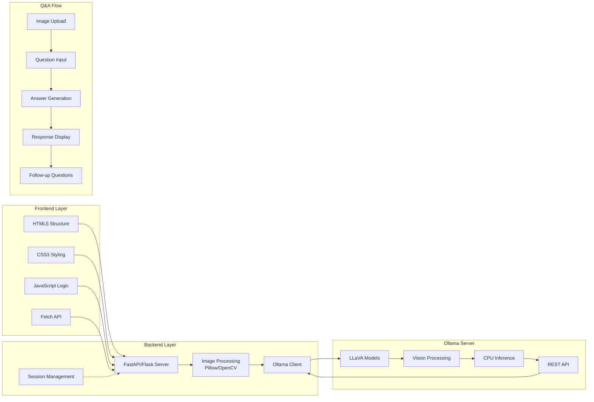
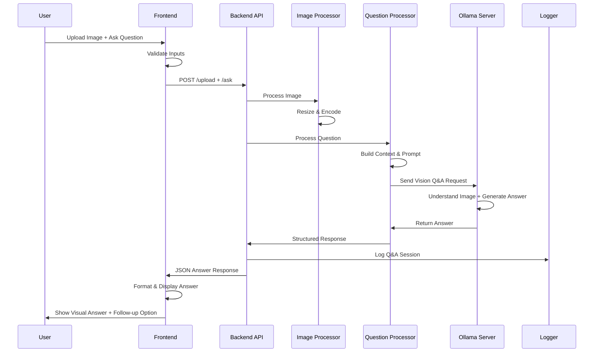
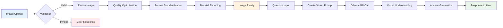
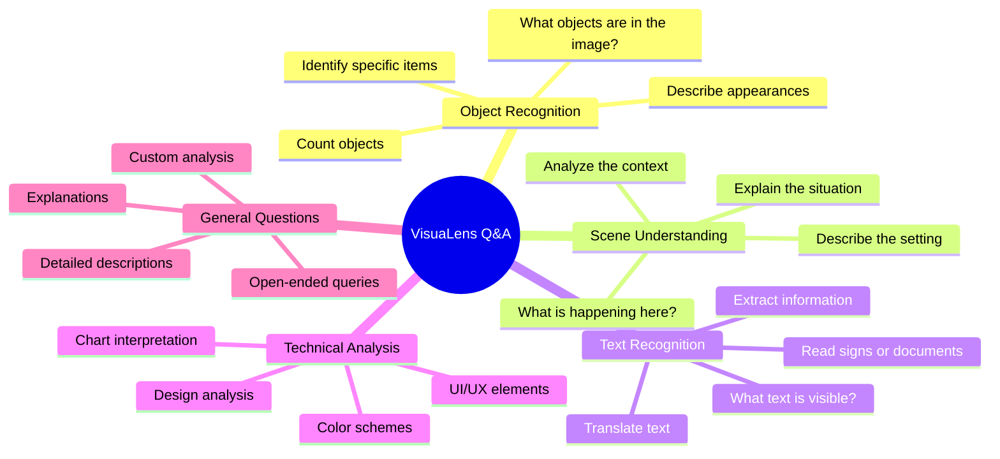

# VisuaLens - Single Image Visual Q&A System Flowchart

## System Architecture Flow

```
┌─────────────────────────────────────────────────────────────────────────────────┐
│                           VisuaLens Visual Q&A System                           │
└─────────────────────────────────────────────────────────────────────────────────┘

┌─────────────────┐    ┌─────────────────┐    ┌─────────────────────────────────┐
│   User Input    │    │  Frontend (HTML │    │        Backend API              │
│                 │    │     /CSS/JS)    │    │       (FastAPI/Flask)          │
│ • Upload Image  │───▶│                 │───▶│                                 │
│ • Ask Question  │    │ • Image Upload  │    │ • Image Validation              │
│ • Submit Query  │    │ • Query Input   │    │ • File Processing               │
│ • View Response │    │ • Q&A Interface │    │ • Request Routing               │
└─────────────────┘    └─────────────────┘    └─────────────────────────────────┘
                                │                            │
                                ▼                            ▼
                    ┌─────────────────┐        ┌─────────────────────────────────┐
                    │  File Upload    │        │      Image Processing          │
                    │   Handling      │        │                                 │
                    │                 │        │ • Resize & Normalize            │
                    │ • Validation    │        │ • Format Conversion             │
                    │ • Temp Storage  │        │ • Quality Enhancement           │
                    │ • Size Check    │        │ • Base64 Encoding               │
                    └─────────────────┘        └─────────────────────────────────┘
                                                            │
                                                            ▼
                                               ┌─────────────────────────────────┐
                                               │     Question Processing         │
                                               │                                 │
                                               │ • Question Validation           │
                                               │ • Context Building              │
                                               │ • Query Formatting              │
                                               │ • Vision Prompt Creation        │
                                               └─────────────────────────────────┘
                                                            │
                                                            ▼
                    ┌─────────────────┐        ┌─────────────────────────────────┐
                    │ Ollama Server   │◀──────│      Ollama Integration         │
                    │                 │        │                                 │
                    │ • LLaVA Model   │        │ • API Client                    │
                    │ • BakLLaVA      │        │ • Request Formation             │
                    │ • Vision Models │        │ • Connection Management         │
                    │ • CPU Optimized │        │ • Error Handling                │
                    └─────────────────┘        └─────────────────────────────────┘
                                │                            │
                                ▼                            ▼
                    ┌─────────────────┐        ┌─────────────────────────────────┐
                    │ Model Response  │        │     Response Processing         │
                    │                 │        │                                 │
                    │ • Visual Answer │───────▶│ • Parse Text Response           │
                    │ • Confidence    │        │ • Extract Key Information       │
                    │ • Reasoning     │        │ • Format Answer                 │
                    │ • Explanations  │        │ • Structure Output              │
                    └─────────────────┘        └─────────────────────────────────┘
                                                            │
                                                            ▼
                                               ┌─────────────────────────────────┐
                                               │        Logging System           │
                                               │                                 │
                                               │ • Question Logging              │
                                               │ • Answer Tracking               │
                                               │ • Performance Metrics           │
                                               │ • Error Logs                    │
                                               └─────────────────────────────────┘
                                                            │
                                                            ▼
                    ┌─────────────────┐        ┌─────────────────────────────────┐
                    │  Frontend UI    │◀──────│      API Response               │
                    │   Display       │        │                                 │
                    │                 │        │ • Text Answer                   │
                    │ • Q&A Interface │        │ • Status Codes                  │
                    │ • Answer Display│        │ • Error Messages                │
                    │ • Follow-up Q's │        │ • Metadata                      │
                    └─────────────────┘        └─────────────────────────────────┘
                                │
                                ▼
                    ┌─────────────────┐
                    │   User Gets     │
                    │  Visual Answer  │
                    │                 │
                    │ • Image Insights│
                    │ • Detailed Info │
                    │ • Explanations  │
                    │ • Follow-up Q's │
                    └─────────────────┘
```

## Detailed Component Flow

### 1. Frontend Flow (HTML/CSS/JS)
```
User Interface
├── Single Image Upload Zone
├── Question Input Field
├── Question Examples/Suggestions
├── Submit Button
├── Q&A History
└── Answer Display Area
```

### 2. Backend Processing Flow
```
API Endpoint
├── /upload (POST)
│   ├── Image Validation
│   ├── File Storage
│   └── Processing Queue
├── /ask (POST)
│   ├── Question Processing
│   ├── Ollama Request
│   └── Answer Generation
└── /history (GET)
    ├── Previous Q&A
    ├── Session Management
    └── Answer Metadata
```

### 3. Ollama Integration Flow
```
Ollama Server Setup
├── Model Installation
│   ├── llava:latest
│   ├── bakllava:latest
│   └── llava:13b (if resources allow)
├── Server Configuration
│   ├── CPU Optimization
│   ├── Memory Management
│   └── Response Timeout
└── API Communication
    ├── Vision Prompt Format
    ├── Dual Image Handling
    └── Response Parsing
```

### 4. Image Processing Pipeline
```
Image Input
├── Validation
│   ├── Format Check (JPEG, PNG, WebP)
│   ├── Size Validation (< 10MB)
│   └── Dimension Check
├── Preprocessing
│   ├── Resize (max 1024x1024)
│   ├── Quality Optimization
│   └── Format Standardization
└── Encoding
    ├── Base64 Conversion
    ├── Metadata Extraction
    └── Ready for Vision Model
```

### 5. Question Processing Flow
```
Question System
├── Input Validation
│   ├── Text Sanitization
│   ├── Length Check
│   └── Language Detection
├── Context Building
│   ├── Image Context
│   ├── Question Analysis
│   └── Intent Recognition
└── Prompt Assembly
    ├── System Instructions
    ├── Image Description
    └── User Question
```

### 6. Answer Processing Flow
```
Model Output
├── Raw Answer Parsing
├── Content Extraction
│   ├── Main Answer
│   ├── Explanations
│   ├── Supporting Details
│   └── Confidence Level
├── Quality Assessment
└── Error Handling
    ├── Answer Validation
    ├── Hallucination Check
    └── Fallback Responses
```

## Data Flow Sequence

1. **User Interaction**: Upload single image + ask question about it
2. **Frontend Processing**: Validate image and question inputs
3. **Backend Reception**: Receive image and question via API
4. **Image Processing**: Resize, optimize, and encode image
5. **Question Processing**: Validate and format user question
6. **Ollama Communication**: Send vision + text request to local server
7. **Model Inference**: Process image and generate answer to question
8. **Answer Processing**: Parse and structure model response
9. **Logging**: Record question, answer, and performance metrics
10. **Frontend Display**: Show formatted answer with explanations
11. **User Review**: Read answer and can ask follow-up questions

## Technology Stack Flow
```
Frontend (Client)
├── HTML5 (Structure)
├── CSS3 (Styling)
├── JavaScript (Interaction)
└── Fetch API (Backend Communication)
        │
        ▼
Backend (Server)
├── Python FastAPI/Flask
├── Image Processing (Pillow)
├── Ollama Client Library
└── Logging System
        │
        ▼
Ollama Server (Local)
├── Vision Language Models
├── CPU Optimized Inference
└── REST API Interface
```

This flowchart provides a complete overview of your VisuaLens system architecture and data flow.

## Mermaid Live Flowchart

### Main System Flow

```mermaid
flowchart TD
    A[User Input<br/>- Upload Single Image<br/>- Ask Question<br/>- Submit Query] --> B[HTML/CSS/JS Frontend<br/>- Image Upload Interface<br/>- Question Input<br/>- Loading States]
    
    B --> C[Backend API<br/>FastAPI/Flask<br/>- Image Validation<br/>- Question Processing<br/>- Request Routing]
    
    C --> D[Image Processing<br/>- Resize & Normalize<br/>- Format Conversion<br/>- Base64 Encoding<br/>- Quality Enhancement]
    
    D --> E[Question Processing<br/>- Input Validation<br/>- Context Building<br/>- Vision Prompt Creation<br/>- Query Formatting]
    
    E --> F[Ollama Integration<br/>- API Client<br/>- Request Formation<br/>- Connection Management<br/>- Error Handling]
    
    F --> G[Ollama Server<br/>- LLaVA Model<br/>- BakLLaVA<br/>- CPU Optimized<br/>- Vision + Text Processing]
    
    G --> H[Model Response<br/>- Visual Understanding<br/>- Answer Generation<br/>- Reasoning<br/>- Explanations]
    
    H --> I[Answer Processing<br/>- Parse Response<br/>- Extract Answer<br/>- Format Output<br/>- Quality Check]
    
    I --> J[Logging System<br/>- Question Logging<br/>- Answer Tracking<br/>- Performance Metrics<br/>- Session History]
    
    J --> K[API Response<br/>- Text Answer<br/>- Status Codes<br/>- Error Messages<br/>- Metadata]
    
    K --> L[Frontend Display<br/>- Answer Presentation<br/>- Q&A Interface<br/>- Follow-up Options<br/>- History View]
    
    L --> M[Final Output<br/>- Visual Answer<br/>- Detailed Explanation<br/>- Supporting Info<br/>- Next Question Option]
    
    style A fill:#e1f5fe
    style G fill:#fff3e0
    style M fill:#e8f5e8
```


### Detailed Architecture Flow


### Component Interaction Flow


### Image Processing Pipeline


### Q&A Interaction Types


## Project Implementation Phases

### Phase 0: Environment Setup & Prerequisites (START HERE)
**Duration**: 1-2 days  
**Priority**: CRITICAL - Must complete before any other phase

#### 0.1 Development Environment Setup
```
Environment Preparation
├── Python Virtual Environment
│   ├── Create venv: python -m venv visualens_env
│   ├── Activate: visualens_env\Scripts\activate (Windows)
│   └── Verify: python --version (3.8+)
├── Project Structure Creation
│   ├── Create main directories
│   ├── Initialize git repository
│   └── Setup .gitignore
└── Dependencies Installation
    ├── Core requirements.txt
    ├── Development tools
    └── Testing frameworks
```

#### 0.2 Ollama Server Setup (Foundation)
```
Ollama Installation & Configuration
├── Install Ollama
│   ├── Download from https://ollama.ai
│   ├── Install for Windows
│   └── Verify installation: ollama --version
├── Model Installation
│   ├── ollama pull llava:latest (Primary model)
│   ├── ollama pull bakllava:latest (Alternative)
│   └── Test: ollama run llava "describe this"
├── Server Configuration
│   ├── CPU optimization settings
│   ├── Memory allocation (4-8GB)
│   └── API endpoint testing
└── Performance Testing
    ├── Simple vision test
    ├── Response time measurement
    └── Resource usage monitoring
```

#### 0.3 Project Structure & Basic Config
```
Directory Structure
├── requirements.txt
├── config/
│   ├── settings.py
│   ├── ollama_config.json
│   └── logging_config.json
├── src/
│   ├── __init__.py
│   ├── models/
│   ├── processing/
│   ├── api/
│   └── utils/
├── frontend/
│   ├── index.html
│   ├── css/
│   ├── js/
│   └── assets/
├── tests/
├── logs/
└── uploads/
```

---

### Phase 1: Ollama Server Integration (SECOND)
**Duration**: 2-3 days  
**Priority**: HIGH - Core functionality foundation

#### 1.1 Ollama Client Development
```
Ollama Integration Layer
├── API Client Class
│   ├── Connection management
│   ├── Request/response handling
│   ├── Error handling & retries
│   └── Health check endpoints
├── Vision Request Formatting
│   ├── Image encoding (base64)
│   ├── Prompt structure
│   ├── Parameter configuration
│   └── Response parsing
└── Testing & Validation
    ├── Unit tests for client
    ├── Integration tests
    └── Performance benchmarks
```

#### 1.2 Basic Q&A Functionality
```
Core Q&A Engine
├── Prompt Engineering
│   ├── System prompt templates
│   ├── Vision prompt structure
│   ├── Context building
│   └── Question formatting
├── Response Processing
│   ├── Text parsing
│   ├── Answer extraction
│   ├── Confidence assessment
│   └── Error handling
└── Basic Testing
    ├── Simple image + question
    ├── Response validation
    └── Edge case handling
```

---

### Phase 2: Backend Layer Implementation (THIRD)
**Duration**: 3-4 days  
**Priority**: HIGH - API and processing logic

#### 2.1 FastAPI Server Setup
```
API Server Development
├── FastAPI Application
│   ├── App initialization
│   ├── CORS configuration
│   ├── Middleware setup
│   └── Error handling
├── Core Endpoints
│   ├── POST /upload (image upload)
│   ├── POST /ask (question processing)
│   ├── GET /health (health check)
│   └── GET /history (session history)
├── Request/Response Models
│   ├── Pydantic schemas
│   ├── Validation rules
│   ├── Error responses
│   └── Success responses
└── Testing Framework
    ├── API testing setup
    ├── Mock data creation
    └── Integration tests
```

#### 2.2 Image Processing Pipeline
```
Image Handling System
├── Upload Management
│   ├── File validation (size, format)
│   ├── Temporary storage
│   ├── Security checks
│   └── Cleanup procedures
├── Image Processing
│   ├── Pillow/OpenCV integration
│   ├── Resize & optimization
│   ├── Format standardization
│   └── Base64 encoding
├── Quality Control
│   ├── Image quality assessment
│   ├── Error detection
│   ├── Fallback procedures
│   └── Logging
└── Performance Optimization
    ├── Async processing
    ├── Memory management
    └── Caching strategies
```

#### 2.3 Session Management
```
Session & State Management
├── Session Handling
│   ├── Session creation/management
│   ├── Q&A history storage
│   ├── Context preservation
│   └── Cleanup procedures
├── Logging System
│   ├── Request/response logging
│   ├── Performance metrics
│   ├── Error tracking
│   └── Analytics data
└── Configuration Management
    ├── Environment variables
    ├── API configuration
    └── Feature flags
```

---

### Phase 3: Frontend Layer Development (FOURTH)
**Duration**: 3-4 days  
**Priority**: MEDIUM - User interface

#### 3.1 HTML5 Structure & CSS3 Styling
```
Frontend Foundation
├── HTML5 Structure
│   ├── Semantic HTML layout
│   ├── Accessibility features
│   ├── Meta tags & SEO
│   └── Progressive enhancement
├── CSS3 Styling
│   ├── Responsive design
│   ├── Modern CSS Grid/Flexbox
│   ├── Custom properties
│   └── Animation & transitions
├── Component Design
│   ├── Image upload zone
│   ├── Question input area
│   ├── Answer display section
│   └── History sidebar
└── Visual Design
    ├── Color scheme
    ├── Typography
    ├── Icons & imagery
    └── Loading states
```

#### 3.2 JavaScript Logic & API Integration
```
Frontend Functionality
├── Core JavaScript
│   ├── ES6+ features
│   ├── Module organization
│   ├── Event handling
│   └── DOM manipulation
├── API Communication
│   ├── Fetch API implementation
│   ├── File upload handling
│   ├── Response processing
│   └── Error handling
├── User Experience
│   ├── Drag & drop upload
│   ├── Real-time validation
│   ├── Loading indicators
│   └── Success/error feedback
└── Interactive Features
    ├── Q&A history
    ├── Follow-up questions
    ├── Image preview
    └── Answer formatting
```

---

### Phase 4: Q&A Flow Integration & Optimization (FINAL)
**Duration**: 2-3 days  
**Priority**: MEDIUM - Full system integration

#### 4.1 End-to-End Integration
```
Complete System Integration
├── Full Workflow Testing
│   ├── Image upload → Processing
│   ├── Question → Answer flow
│   ├── Session management
│   └── Error scenarios
├── Performance Optimization
│   ├── Response time optimization
│   ├── Memory usage optimization
│   ├── Concurrent request handling
│   └── Caching implementation
├── User Experience Enhancement
│   ├── Loading state improvements
│   ├── Error message refinement
│   ├── Success feedback
│   └── Progressive enhancement
└── Quality Assurance
    ├── Cross-browser testing
    ├── Responsive design testing
    ├── Accessibility testing
    └── Performance testing
```

#### 4.2 Advanced Features & Polish
```
Advanced Feature Implementation
├── Enhanced Q&A Features
│   ├── Question suggestions
│   ├── Context-aware follow-ups
│   ├── Answer confidence display
│   └── Multi-turn conversations
├── Analytics & Monitoring
│   ├── Usage analytics
│   ├── Performance monitoring
│   ├── Error tracking
│   └── User behavior insights
├── Documentation & Deployment
│   ├── API documentation
│   ├── User guide
│   ├── Deployment scripts
│   └── Production configuration
└── Testing & Validation
    ├── Comprehensive testing
    ├── User acceptance testing
    ├── Performance benchmarks
    └── Security audit
```

## Implementation Order Summary

1. **Phase 0** (CRITICAL): Environment setup, Ollama installation, project structure
2. **Phase 1** (HIGH): Ollama integration, basic Q&A functionality  
3. **Phase 2** (HIGH): Backend API, image processing, session management
4. **Phase 3** (MEDIUM): Frontend development, UI/UX implementation
5. **Phase 4** (MEDIUM): Integration, optimization, advanced features

## Getting Started Checklist

### Before You Begin:
- [ ] Install Python 3.8+
- [ ] Install Ollama
- [ ] Download LLaVA model
- [ ] Create project directory
- [ ] Setup virtual environment
- [ ] Install base dependencies

### Phase 0 Immediate Actions:
1. Create and activate virtual environment
2. Install Ollama and test basic functionality
3. Create project structure
4. Setup basic configuration files
5. Test Ollama with simple vision query

This phased approach ensures a solid foundation before moving to complex integrations, minimizing debugging issues and ensuring each component works independently before integration.
